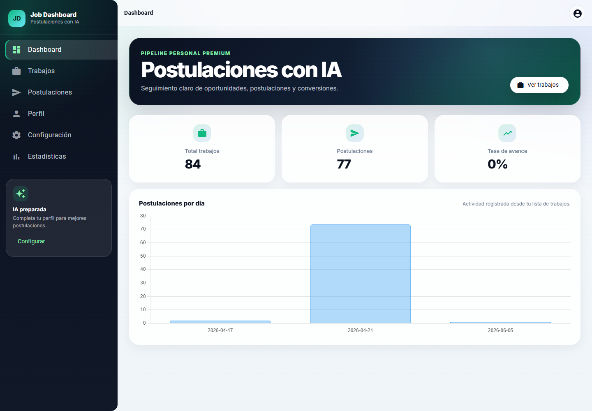
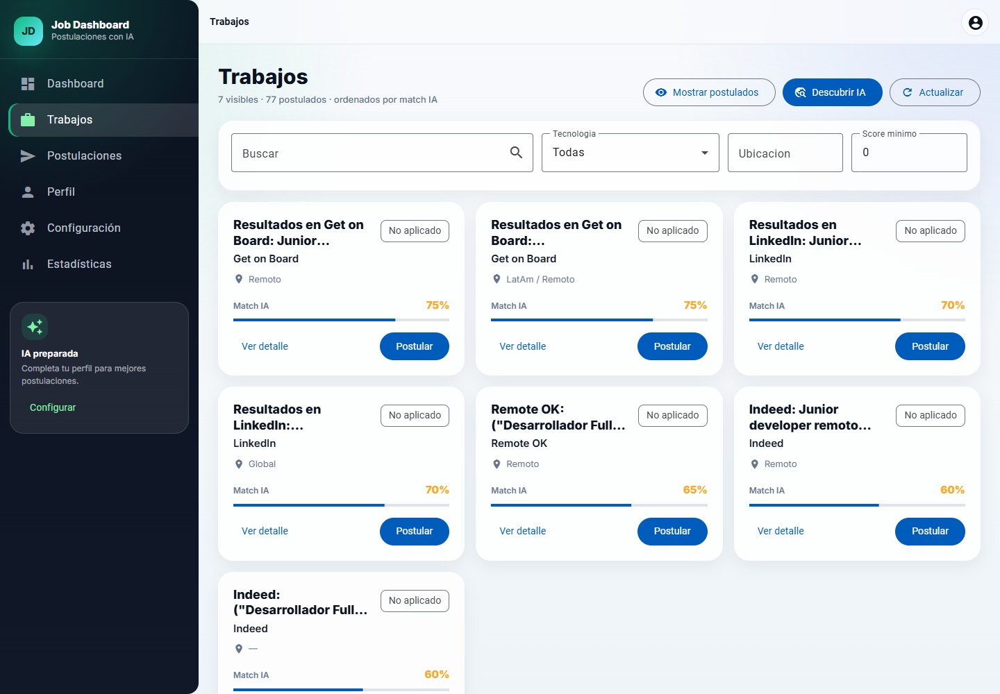
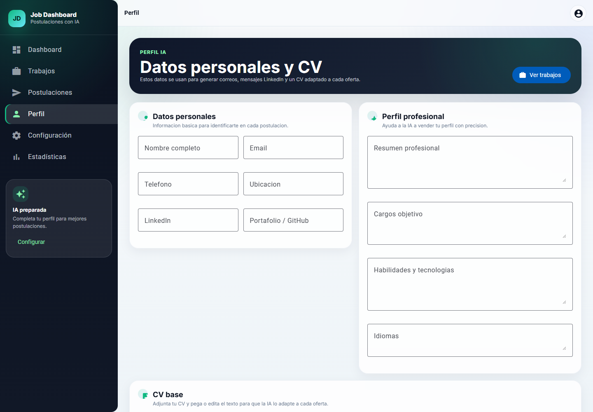
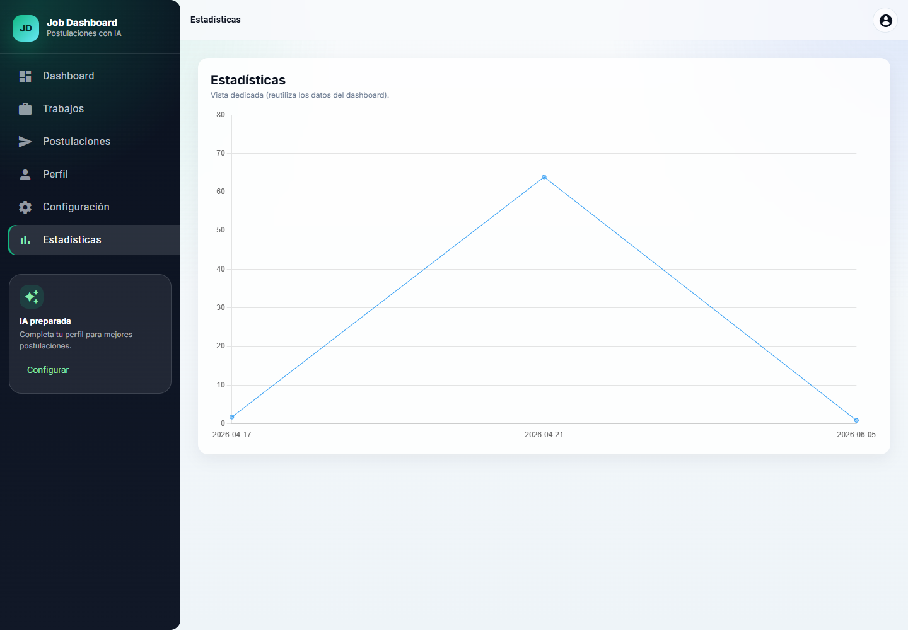

# Job Dashboard

Aplicacion web para gestionar postulaciones laborales con apoyo de IA. Permite centralizar ofertas, medir el avance del pipeline, descubrir nuevas oportunidades y generar textos de postulacion adaptados al perfil del candidato.



## Contenido

- `job-dashboard/`: frontend Angular con Angular Material, rutas standalone, SCSS y graficos con Chart.js.
- `job-backend/`: backend Express con persistencia local en JSON e integracion con OpenAI.
- `docs/images/`: capturas de pantalla usadas en este README.

## Funcionalidades

- Dashboard con KPIs de trabajos, postulaciones y tasa de avance.
- Lista de trabajos ordenada por match IA.
- Filtros por texto, tecnologia, ubicacion y score minimo.
- Marcado de trabajos como postulados.
- Detalle de oferta con informacion, tecnologias y razones del match.
- Generador de correo, mensaje de LinkedIn y CV adaptado a una oferta.
- Perfil personal para que la IA use datos del candidato.
- Descubrimiento de trabajos mediante IA y busqueda web.
- Estadisticas de postulaciones por fecha.

## Capturas

### Trabajos



### Perfil



### Estadisticas



## Stack Tecnico

| Capa | Tecnologia |
| --- | --- |
| Frontend | Angular 21, Angular Material, SCSS |
| Graficos | Chart.js, ng2-charts |
| Backend | Node.js, Express |
| IA | OpenAI API |
| Persistencia | Archivo JSON local |

## Requisitos

- Node.js 20 o superior.
- npm.
- Una `OPENAI_API_KEY` con billing activo si se usaran funciones reales de IA.

Para una demo sin credito de OpenAI, el backend soporta `MOCK_ON_QUOTA=1`.

## Configuracion

### 1. Backend

```powershell
cd job-backend
npm.cmd install
Copy-Item .env.example .env
```

Edita `job-backend/.env`:

```env
OPENAI_API_KEY=tu_api_key
PORT=8000
MOCK_ON_QUOTA=1
```

Levanta el backend:

```powershell
npm.cmd run dev
```

Comprueba que este activo:

```powershell
curl.exe http://localhost:8000/health
```

### 2. Frontend

En otra terminal:

```powershell
cd job-dashboard
npm.cmd install
npm.cmd start
```

Abre la app en:

```text
http://localhost:4200
```

El frontend consume por defecto:

```text
http://localhost:8000
```

Si cambias el puerto del backend, actualiza `job-dashboard/src/app/core/config/api-base-url.ts`.

## Endpoints del Backend

| Metodo | Ruta | Descripcion |
| --- | --- | --- |
| `GET` | `/health` | Estado del backend |
| `GET` | `/jobs` | Lista de trabajos guardados |
| `POST` | `/jobs` | Crea/importa un trabajo |
| `PUT` | `/jobs/:id/apply` | Marca un trabajo como postulado |
| `POST` | `/generate` | Genera correo, LinkedIn y CV con IA |
| `POST` | `/discover` | Busca ofertas con IA |

## Estructura

```text
Postular_app/
|-- job-backend/
|   |-- src/
|   |   |-- server.mjs
|   |   |-- store.mjs
|   |   `-- openai.mjs
|   |-- data/
|   |   `-- jobs.json
|   `-- package.json
|-- job-dashboard/
|   |-- src/
|   |   `-- app/
|   |       |-- core/
|   |       `-- features/
|   `-- package.json
|-- docs/
|   `-- images/
`-- README.md
```

## Modo Demo

Si OpenAI responde con errores de cuota o no tienes credito activo, configura:

```env
MOCK_ON_QUOTA=1
```

Con ese valor:

- `/discover` devuelve resultados mock.
- `/generate` devuelve textos mock para correo, LinkedIn y CV.

## Problemas Comunes

### `net::ERR_CONNECTION_REFUSED :8000`

El backend no esta corriendo o esta usando otro puerto. Ejecuta:

```powershell
cd job-backend
npm.cmd run dev
```

### `429 insufficient_quota`

La cuenta de OpenAI no tiene credito o billing activo. Usa una API key con credito o activa `MOCK_ON_QUOTA=1`.

### Error de extension del navegador

Si aparece un error de una URL `chrome-extension://`, normalmente viene de una extension instalada, no de la app. Prueba con modo incognito o desactiva extensiones.

## Comandos Utiles

```powershell
# Backend
cd job-backend
npm.cmd run dev

# Frontend
cd job-dashboard
npm.cmd start

# Build frontend
cd job-dashboard
npm.cmd run build
```
